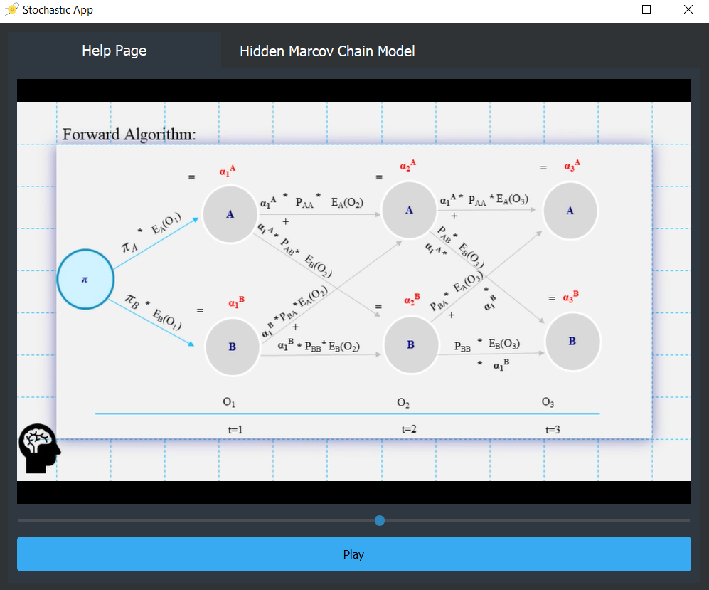
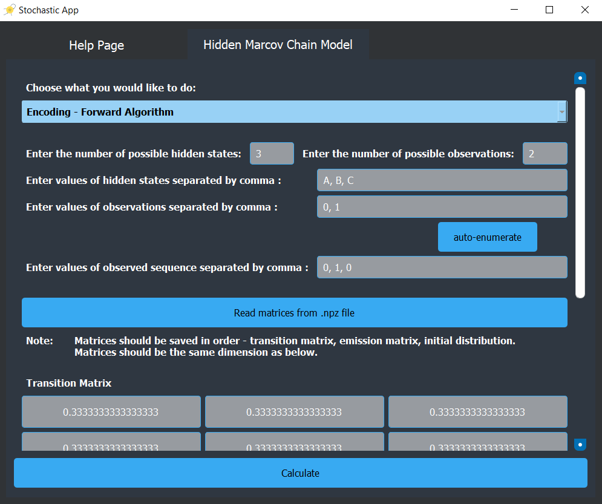
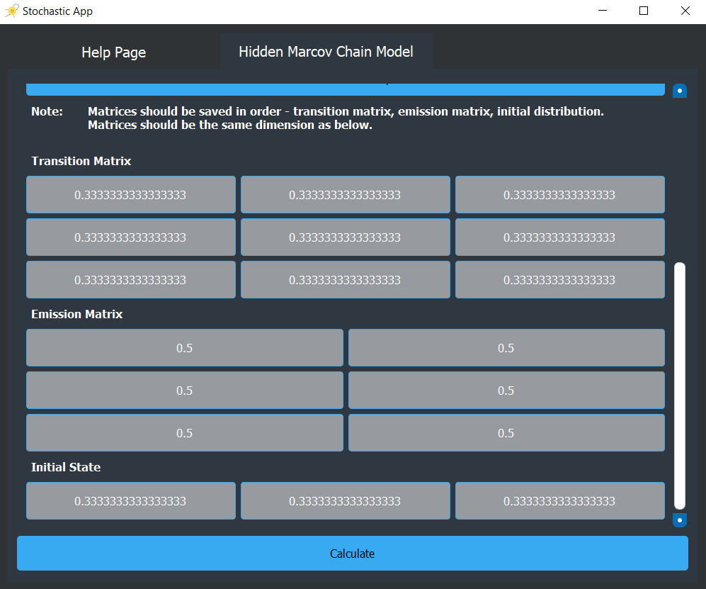
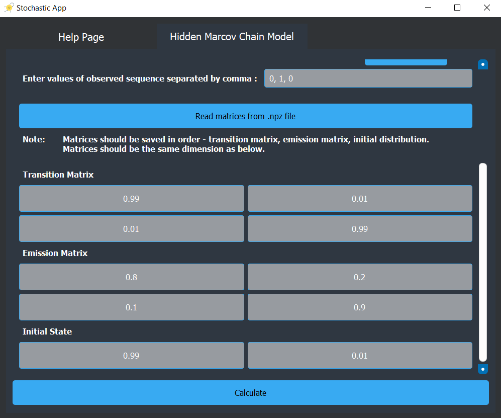
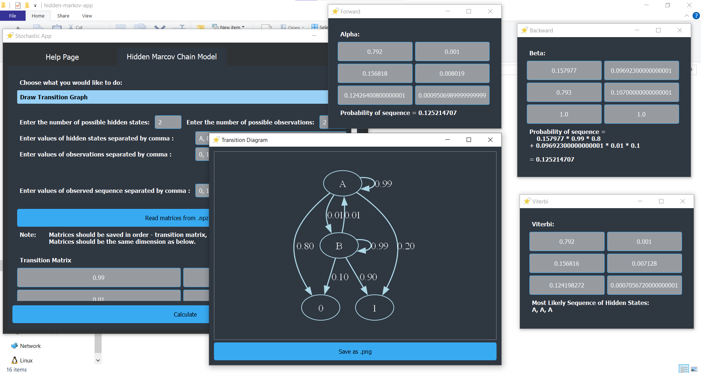
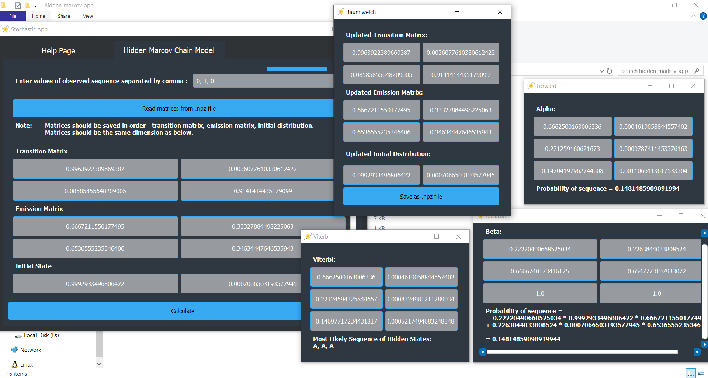
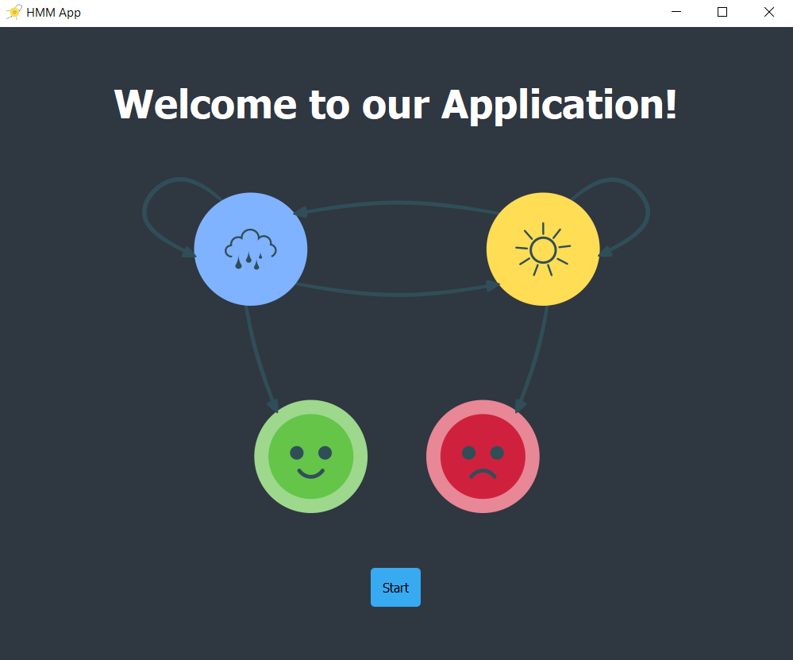

# hidden-markov-app

We implemented this app for our final project in the Stochastic Processes course taught by Prof. Amr Amin.<br/>
We had an assignment to implement Baum–Welch Algorithm. The python implementation can be found in ```hmm_implementation.py``` file. We then created a PyQT5 app to leverage this implementation.

## Application Overview

The main window of our application has two tabs.

The first is a small Help tab, with a simple presentation video that includes an overview of Hidden Markov Models.


<br/>

The second is the Model tab, where you can use the Hidden Markov Model. There are 5 possible operations that you can choose from the dropdown: Forward Encoding, Backward Encoding, Viterbi Decoding, Baum-Welch Learning, and drawing a transition graph.



<br/><br/>

Here's how we ran these operations on this sample data.
<br/><br/>
Number of possible hidden states: 2<br/>
Number of possible observations: 2<br/>

<br/>

This was the Transition Graph, and the Forward, Backward, and Viterbi output.

<br/>

Then, after running the Baum-Welch algorithm, and inputting the updated data into the application, we can recalculate to get the following output.

<br/><br/>

## How to Use

To run this app, you need to have [Git](https://git-scm.com/downloads), [Python](https://www.python.org/downloads/), and [Graphviz](https://graphviz.org/download/) installed on your computer.<br/>

Here's how you can check:
``` bash
# Check Git installation
$ git --version

# Check Python installation
$ python --version

# Check Graphviz installation
$ dot -V
```

If you have everything installed, you can go ahead and run the following:

```bash
# Clone the repository
$ git clone https://github.com/verinak/hidden-markov-app

# Navigate into cloned directory
$ cd hidden-markov-app

# Install app requirements
$ pip install -r requirements.txt

# Run app
$ python run_app.py
```

If everything's working fine, you should see the app's welcome window.<br/>




## Contributors

[Ola Mamdouh](https://github.com/olamahdi)<br>
[Verina Michel](https://github.com/verinak)<br>
[Marly Magdy](https://github.com/marlymagdy)<br>
[Maria Anwar](https://github.com/MariAnwar)<br>
[Mirna Tarek](https://github.com/Mirna-tarek)<br>
[Mariem Nasr](https://github.com/MariemNasr)<br>

